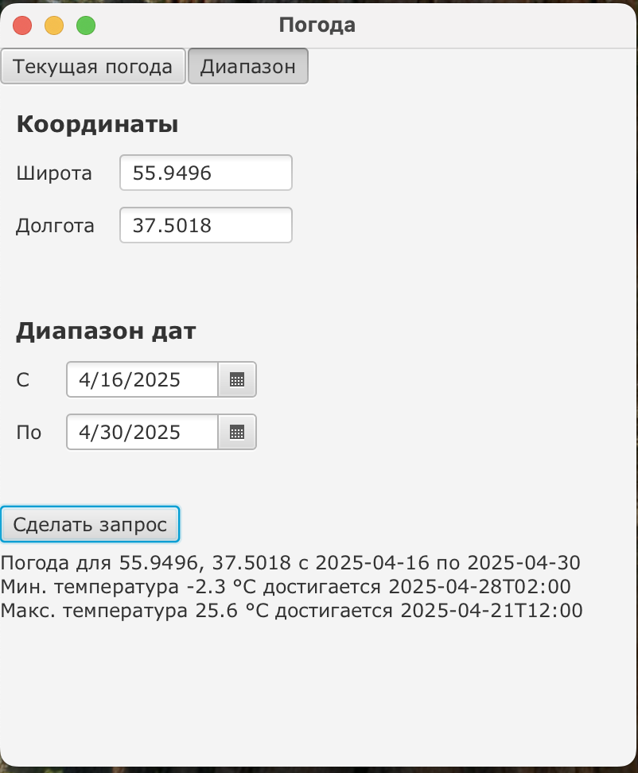

# Kotlin-Meteo

Небольшое настольное приложение, которое берёт
данные из **[Open-Meteo](https://open-meteo.com)** и показывает:

* **Текущую температуру** для указанных широты/долготы
* **Минимум / максимум температуры** за выбранный диапазон дат
  (почасовая выборка)

> **Зачем?**  
> Демонстрация:
> * работы корутин с JavaFX (`Dispatchers.JavaFx`)
> * сетевых запросов на Ktor-Client (CIO-движок)
> * десериализации JSON через Kotlin Serialization
> * простого разделения слоёв *View ⇆ Controller ⇆ HTTP-клиент*

---

## ✨ Возможности

| Режим | Что вводим              | Что получаем                                   |
|-------|-------------------------|-----------------------------------------------|
| **Текущая** | широта, долгота       | `23.4 °C`                                      |
| **Диапазон**| широта, долгота, дата «с», дата «по» | минимальную и максимальную температуру **и** время их достижения |

Проверяется корректность ввода:
* широта ∉ –90…90°, долгота ∉ –180…180°
* пустые / перепутанные даты

Все сетевые вызовы выполняются **вне UI-потока** (`Dispatchers.IO`), интерфейс не зависает; при закрытии окна все корутины отменяются автоматом.

---

## 🖥️ Как выглядит интерфейс

